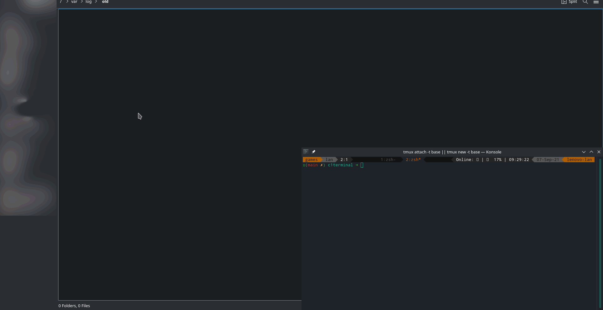

<!-- credits: https://github.com/othneildrew/Best-README-Template>

<!-- PROJECT SHIELDS -->
<!--
*** I'm using markdown "reference style" links for readability.
*** Reference links are enclosed in brackets [ ] instead of parentheses ( ).
*** See the bottom of this document for the declaration of the reference variables
*** for contributors-url, forks-url, etc. This is an optional, concise syntax you may use.
*** https://www.markdownguide.org/basic-syntax/#reference-style-links
-->
<!-- [![Contributors][contributors-shield]][contributors-url] -->
<!-- [![Forks][forks-shield]][forks-url] -->
<!-- [![Stargazers][stars-shield]][stars-url] -->
<!-- [![Issues][issues-shield]][issues-url] -->
[![MIT License][license-shield]][license-url]
<!-- [![LinkedIn][linkedin-shield]][linkedin-url] -->


<!-- PROJECT LOGO -->
<br />
<p align="center">
  <a href="https://github.com/LanHikari22/terminal_selemium_replay">
    
  </a>

  <h3 align="center">Terminal: Watch the replay file in firefox</h3>

  <p align="center">
    uses selemium to automate opening a replay file in the C1 games terminal playground
    <br />
    <a href="https://raw.githubusercontent.com/LanHikari22/terminal_selemium_replay/main/images/demo.gif">View Demo</a>
    ·
    <a href="https://github.com/LanHikari22/terminal_selemium_replay/issues">Report Bug</a>
    ·
    <a href="https://github.com/LanHikari22/terminal_selemium_replay/issues">Request Feature</a>
  </p>
</p>


<!-- TABLE OF CONTENTS -->
<details open="open">
  <summary><h2 style="display: inline-block">Table of Contents</h2></summary>
  <ol>
    <li>
      <a href="#getting-started">Getting Started</a>
      <ul>
        <li><a href="#prerequisites">Prerequisites</a></li>
        <li><a href="#installation">Installation</a></li>
      </ul>
    </li>
    <li>
      <a href="#usage">Usage</a>
      <ul>
        <li><a href="#demo">Demo</a></li>
      </ul>
    </li>
    <li><a href="#contributing">Contributing</a></li>
    <li><a href="#license">License</a></li>
    <li><a href="#acknowledgements">Acknowledgements</a></li>
  </ol>
</details>


<!-- GETTING STARTED -->
## Getting Started

### Prerequisites

- Install python3 and pip
- Install [selenium with Firefox as the web driver](https://selenium-python.readthedocs.io/installation.html)

### Installation

Once the preequisite tools are installed, you should be able to simply run the python script. 


<!-- USAGE EXAMPLES -->
## Usage

- First, copy `c1terminal.secret.example` to `c1terminal.secret` and provide an email and password to use for selenium to
login to Terminal.
- Next, run
```py
  python3 terminal_replay.py "replay file"
```

### Demo
<p align="center">
  <a href="https://raw.githubusercontent.com/LanHikari22/terminal_selemium_replay/main/images/demo.gif">
    
  </a>

  <h5 align="center">Demo running the selenium script to watch a replay. Click on it to enlarge.</h3>
</p>

<!-- CONTRIBUTING -->
## Contributing

Contributions are what make the open source community such an amazing place to learn, inspire, and create. Any contributions you make are **greatly appreciated**.

1. Fork the Project
2. Create your Feature Branch (`git checkout -b feature/AmazingFeature`)
3. Commit your Changes (`git commit -m 'Add some AmazingFeature'`)
4. Push to the Branch (`git push origin feature/AmazingFeature`)
5. Open a Pull Request


<!-- LICENSE -->
## License

Distributed under the MIT License. See `LICENSE` for more information.


<!-- ACKNOWLEDGEMENTS -->
## Acknowledgements

- [Best-README-Template](https://github.com/othneildrew/Best-README-Template)

<!-- MARKDOWN LINKS & IMAGES -->
<!-- https://www.markdownguide.org/basic-syntax/#reference-style-links -->
[contributors-shield]: https://img.shields.io/github/contributors/github_username/repo.svg?style=for-the-badge
[contributors-url]: https://github.com/github_username/repo_name/graphs/contributors
[forks-shield]: https://img.shields.io/github/forks/github_username/repo.svg?style=for-the-badge
[forks-url]: https://github.com/github_username/repo_name/network/members
[stars-shield]: https://img.shields.io/github/stars/github_username/repo.svg?style=for-the-badge
[stars-url]: https://github.com/github_username/repo_name/stargazers
[issues-shield]: https://img.shields.io/github/issues/github_username/repo.svg?style=for-the-badge
[issues-url]: https://github.com/github_username/repo_name/issues
[license-shield]: https://img.shields.io/github/license/LanHikari22/terminal_selemium_replay.svg?style=for-the-badge
[license-url]: https://github.com/LanHikari22/terminal_selemium_replay/blob/master/LICENSE.txt
[linkedin-shield]: https://img.shields.io/badge/-LinkedIn-black.svg?style=for-the-badge&logo=linkedin&colorB=555
[linkedin-url]: https://linkedin.com/in/github_username
